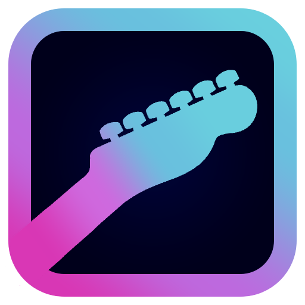

<div align="center">
  
  <h1 align="center">The Fretboard Game</h1>
  <p align="center">Master the guitar fretboard with real-time audio detection</p>
</div>

<p align="center">
  
  
</p>

---

## About

The Fretboard Game is a desktop application that helps guitarists learn and memorize the fretboard using real-time pitch detection. Play notes on your guitar, and the app tells you if you're hitting the right notes — all through your microphone, no special cables needed.

Built with React, Electron, TypeScript, and Web Audio API.

## Features

- **Real-time pitch detection** — play your guitar, get instant feedback
- **Built-in tuner** — tune all strings before starting
- **Multiple difficulties** — Strummer (casual), Lead (intermediate), Rockstar (expert)
- **Game modes** — random strings or per-string practice
- **Session timer** — 1, 3, 5, or 10 minute sessions
- **Detailed reports** — accuracy, errors per string, most-missed notes
- **Cross-platform** — works on Linux, macOS, and Windows

## Download

Pre-built binaries are available on the [Releases page](https://github.com/LeonN534/The-Fretboard-Game/releases). Download the file for your platform, then run it — no installation required.

| Platform | File to download | How to use |
|----------|-----------------|------------|
| **Linux** | `Fretboard Game-*.AppImage` | `chmod +x` the file, then double-click or run it |
| **Windows** | `Fretboard Game *.exe` (portable) | Double-click to run, no install needed |
| **macOS** | `Fretboard Game-*-mac.zip` | Extract the zip, then run the app |

> **Linux users**: if the AppImage doesn't run, try `chmod +x Fretboard*.AppImage && ./Fretboard*.AppImage`  
> **macOS users**: you may need to right-click the app and select "Open" the first time to bypass Gatekeeper

## Usage

1. **Launch the app** — you'll see the main menu
2. **Start Game** — the app checks your audio setup
3. **Audio Setup** — select your microphone and adjust input volume
4. **Tune your guitar** — tap each string and tune until it's in the green
5. **Select challenge** — choose difficulty, mode, and timer
6. **Countdown** — 3... 2... 1... GO!
7. **Play!** — the app shows a note and string; play it on your guitar
8. **Session Report** — see your accuracy, errors, and most-missed notes

### Game Modes

- **All Strings** — random notes across all strings within a time limit
- **Per String** — 20 questions per string, one string at a time

### Difficulties

| Level | Per-question timer | Description |
|-------|-------------------|-------------|
| Strummer | 15s | Casual pace, good for beginners |
| Lead | 7s | Intermediate challenge |
| Rockstar | 3s | Expert speed training |

## Building from Source

### Prerequisites

- [Node.js](https://nodejs.org/) (v18 or later)
- [pnpm](https://pnpm.io/) (v8 or later)

### Setup

```bash
# Clone the repository
git clone https://github.com/LeonN534/The-Fretboard-Game.git
cd The-Fretboard-Game

# Install dependencies
pnpm install

# Run in development mode
pnpm run dev

# Or run the Electron app in development
pnpm run electron:dev
```

### Build for Distribution

```bash
# Build for current platform
pnpm run electron:build

# Build for a specific platform
pnpm run electron:build:linux   # AppImage + deb
pnpm run electron:build:win     # NSIS installer + portable
pnpm run electron:build:mac     # DMG + ZIP
```

Outputs go to the `release/` directory.

## Technologies

- **Frontend**: React 19, TypeScript, Vite, Tailwind CSS
- **Desktop**: Electron 42
- **State**: Zustand
- **Audio**: Web Audio API (custom autocorrelation pitch detection)
- **Icons**: Lucide React
- **Fonts**: Righteous, Poppins (via Google Fonts)

## Project Structure

```
src/
├── components/        # React components (screens and UI)
│   ├── ui/            # Base UI primitives (Button)
│   ├── MainMenu.tsx   # Home screen
│   ├── AudioSetup.tsx # Microphone setup
│   ├── Tuner.tsx      # Guitar tuner
│   ├── ModeSelect.tsx # Difficulty and mode selection
│   ├── Countdown.tsx  # Pre-game countdown
│   ├── GameScreen.tsx # Main gameplay
│   ├── ReportScreen.tsx # Session report
│   ├── Settings.tsx   # App settings
│   ├── AudioSettingsPanel.tsx # Audio controls
│   └── GuitarConfigPanel.tsx  # Guitar configuration
├── hooks/             # Custom React hooks
│   ├── useAudio.ts           # Web Audio API management
│   ├── useAudioConfig.ts     # Audio config persistence
│   ├── usePitchDetection.ts  # Real-time pitch detection
│   └── useGuitarConfig.ts    # Guitar config persistence
├── lib/               # Utility libraries
│   ├── notes.ts              # Music theory and fretboard math
│   ├── pitchDetection.ts     # Autocorrelation pitch detection
│   └── soundManager.ts       # Sound effects (Web Audio oscillators)
├── store/             # Zustand state stores
│   ├── useStore.ts           # Screen routing
│   └── useGameStore.ts       # Game state and scoring
├── App.tsx            # Root component with routing
└── index.css          # Global styles and CSS variables
electron/
├── main.js            # Electron main process
└── preload.js         # Electron preload (context bridge)
```

## Color Palette

The app's visual identity is built around the logo colors:

| Color | Hex | Usage |
|-------|-----|-------|
| Cyan | `#69cfde` | Primary accent, buttons, interactive elements |
| Purple | `#be69de` | Secondary accent |
| Magenta | `#d937b5` | Highlights and special elements |

Background is near-black (`#050508`) with a subtle cyan grid glow effect.

## Contributing

Contributions are welcome! Here's how to get started:

1. **Fork** the repository on GitHub
2. **Clone** your fork: `git clone https://github.com/your-username/The-Fretboard-Game.git`
3. **Create a branch**: `git checkout -b feature/your-feature-name`
4. **Make your changes** following the existing code style
5. **Build and test**: `npm run build` — make sure TypeScript and Vite succeed
6. **Commit** with a clear message: `git commit -m "Add feature: your feature description"`
7. **Push** to your fork: `git push origin feature/your-feature-name`
8. **Open a Pull Request** against the `main` branch

### Development Guidelines

- Follow the existing component patterns (functional components, hooks)
- Use Tailwind utility classes for styling — avoid inline styles and CSS files
- Import `@/` path alias for src directory imports
- Keep components focused and single-responsibility
- Don't add emoji icons — use Lucide SVG icons
- Use `cursor-pointer` on all clickable elements
- Run `npm run build` before submitting to verify no TypeScript errors

## Donations

If you find this project useful, consider supporting its development:

<p align="center">
  <a href="https://ko-fi.com/T5B120EBPE" target="_blank">
    
  </a>
  &nbsp;&nbsp;&nbsp;
  <a href="https://liberapay.com/LeonN534/donate" target="_blank">
    
  </a>
</p>

## License

MIT License — see [LICENSE](LICENSE) for details.
